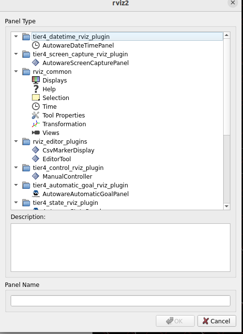
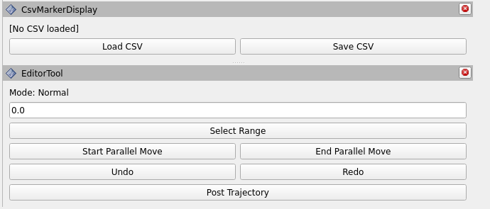
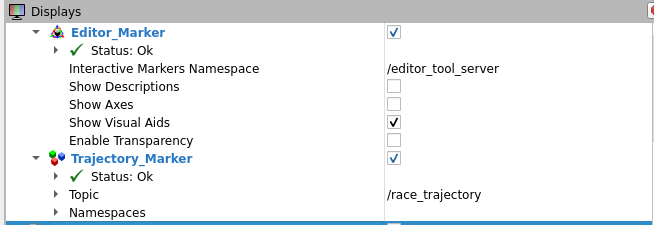
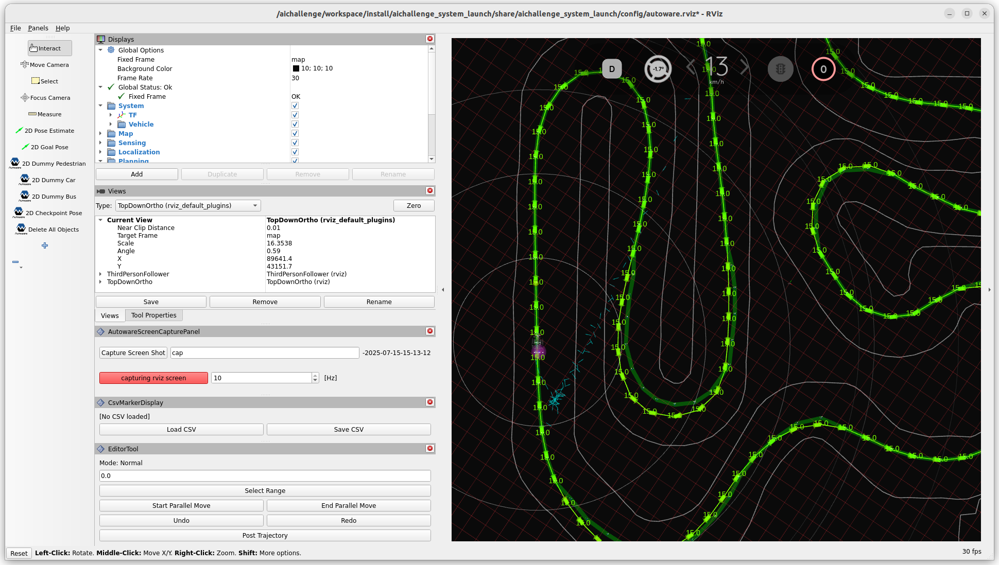

# aichallenge-trajectory-editor
This project is a plugin for editing vehicle tracks on Rviz.
## 主な機能
`aichallenge-trajectory-editor`は、ROS 2 および Autoware 環境向けに開発された、車両の軌跡を編集するためのRvizプラグインです。このリポジトリは、以下の主要な機能を提供しています。

* **軌跡データの管理**
    * CSV形式の軌跡データを読み込み、Rviz上に表示することができます。
    * 編集した軌跡データをCSVファイルとして保存することができます。
* **Rviz上での軌跡編集**
    * **速度の変更**: Rviz上で軌跡上の任意の点(複数点も可能)を選択し、その軌跡ポイントの速度を変更できます。速度に応じてマーカーの色が自動的に変更されます。
    * **平行移動**: 選択した2点間のすべての点を平行移動させることができます。
    * **Undo/Redo**: 軌跡編集の操作を元に戻したり、やり直したりする機能があります。
* **Autowareとの連携**
    * 編集した軌跡は、Autowareの`/planning/scenario_planning/trajectory`トピックにパブリッシュすることが可能です。これにより、編集結果をAutowareのプランニングモジュールに反映させることができます。
    * 軌跡の初期読み込みやパブリッシュに関するパラメータ（例：`csv_file_path`、`publish_on_initialize`、`wait_seconds`、`grad_min_speed`、`grad_mid_speed`、`grad_max_speed`）を設定ファイルで定義できます。

このツールは、Autowareで自動運転シミュレーションを行う際に、車両が走行する軌跡を手動で調整し、その影響を即座に確認できるインタラクティブな環境を提供することを目的としています。
## AIChallenge Trajectory Editorの使い方
aichallenge trajectory editorの使い方
まず、このレポジトリを任意のwsにcloneしてください。
今回は,`~/aichallenge/workspace/src`配下にcloneすることをおすすめします。
```bash
git clone https://github.com/iASL-Gifu/aichallenge-trajectory-editor.git
```

次に`~/aichallenge-2025/workspace/src/aichallenge_submit/aichallenge_submit_launch/launch/aichallenge_submit.launch.xml`に以下を追加します。

```xml
<node pkg="editor_tool_server" exec="interactive_server" output="screen" name="editor_tool_server">
    <param name="csv_file_path" value="/aichallenge/workspace/src/aichallenge-trajectory-editor/csv/centerline_15km.csv"/>
    <param name="publish_on_initialize" value="true"/>
    <param name="wait_seconds" value="5.0"/>
    <param name="grad_min_speed" value="0.0"/>
    <param name="grad_mid_speed" value="20.0"/>
    <param name="grad_max_speed" value="40.0"/>
</node>
```
次にdockerに入り、次のコマンドを実行します。
```bash
./build_autoware.bash
```

次にAutowareを起動し、Rviz画面上部の`Pannel->Add new panel`を選択します。


次に`rviz_editor_plugins`にあるCsvMarkerDisplay・EditorToolを追加します。



新たにdisplayが追加されます。



最後に、`/race_trajectory`と`/editor_tool_server`のtopicを描画して下さい。


以下のように表示されます。必要に応じてRviz画面をFile→Saveして下さい。



# 機能説明

load csv: csvを指定することでtrajectoryをloadできます。

save csv: trajectoryをsaveする機能です。　

select range: 上部のtext editorに埋め込まれている速度を指定した区間に反映します。　

start parallel move & end parallel move: 選択した２点間にあるすべての点を平行移動できるようにします。終了時にendしてください。

post trajectory: Editorの車両経路をAutowareに反映させます。

